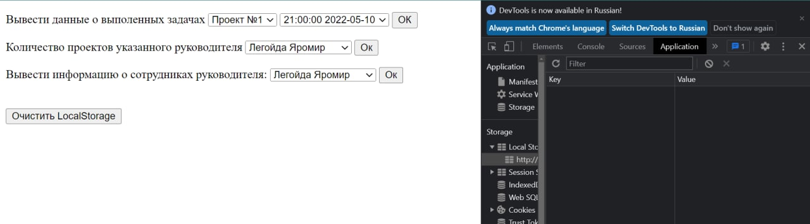
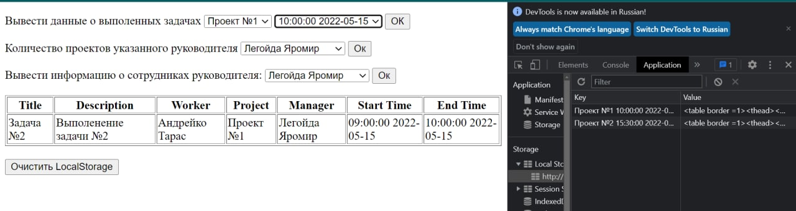
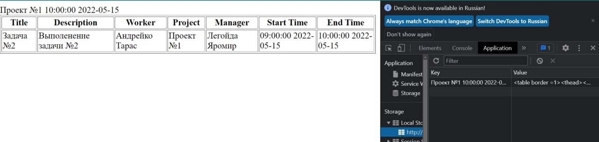
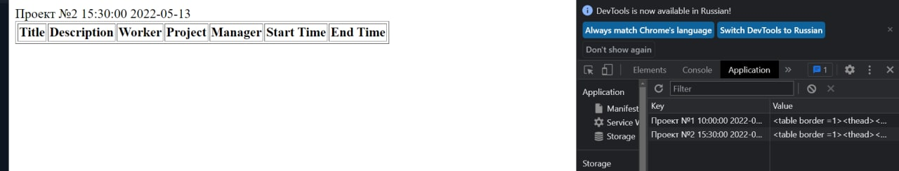
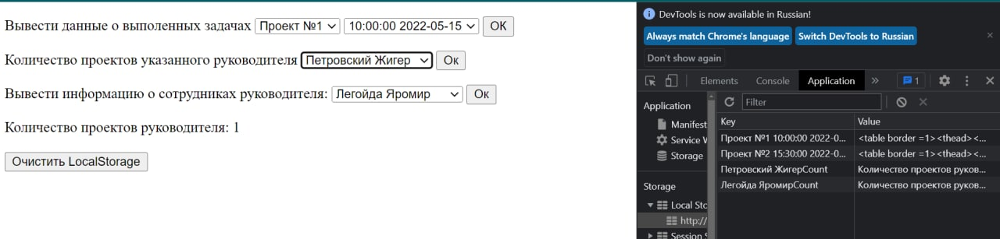
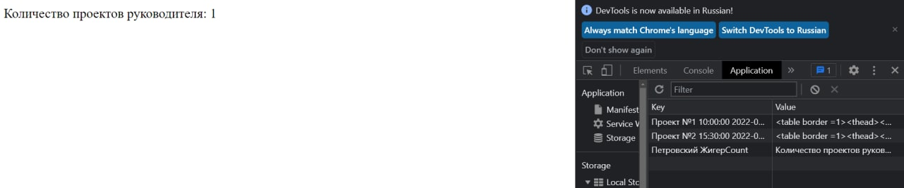
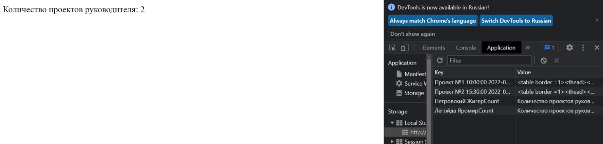
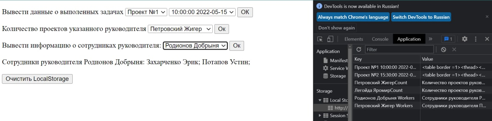
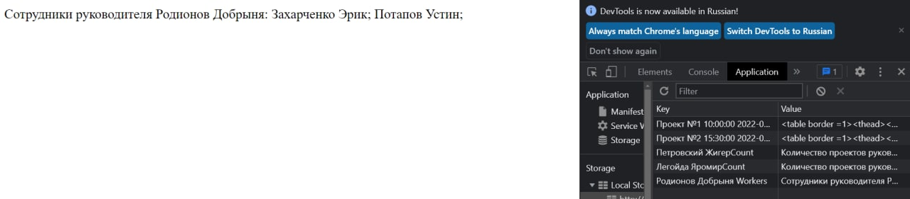
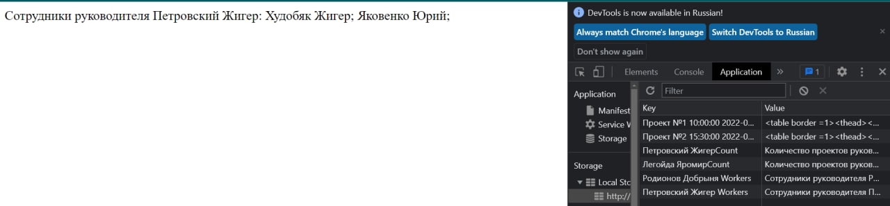

КИУКИ-19-1 Свиридов Александр Александрович

Вариант 2. Создать и заполнить БД для хранения информации о работе над задачами. Каждая задача относится к какому-то проекту, и описывается названием, кратким описанием, работником, выполнявшим проект (может быть больше одного), руководителем, ответственным за проект на момент выполнения этой задачи, временем начала и временем завершения работы. Для хранения даты и времени в БД рекомендуется использовать формат Unix Timestamp.

Предоставить пользователю возможность получения информации о:

выполненных задачах по выбранному проекту на указанную дату;

количестве проектов указанного руководителя;

сотрудниках, работавших под началом выбранного руководителя.

