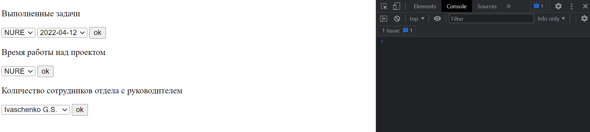
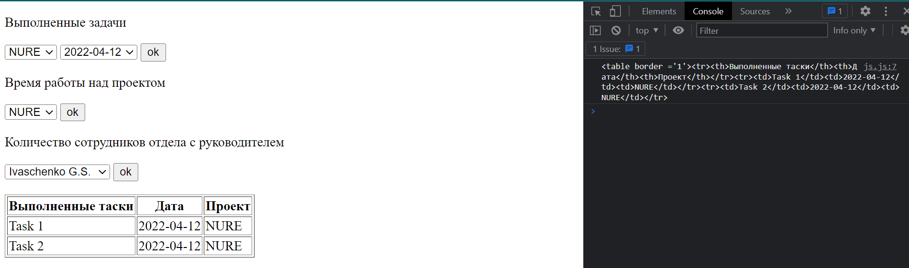
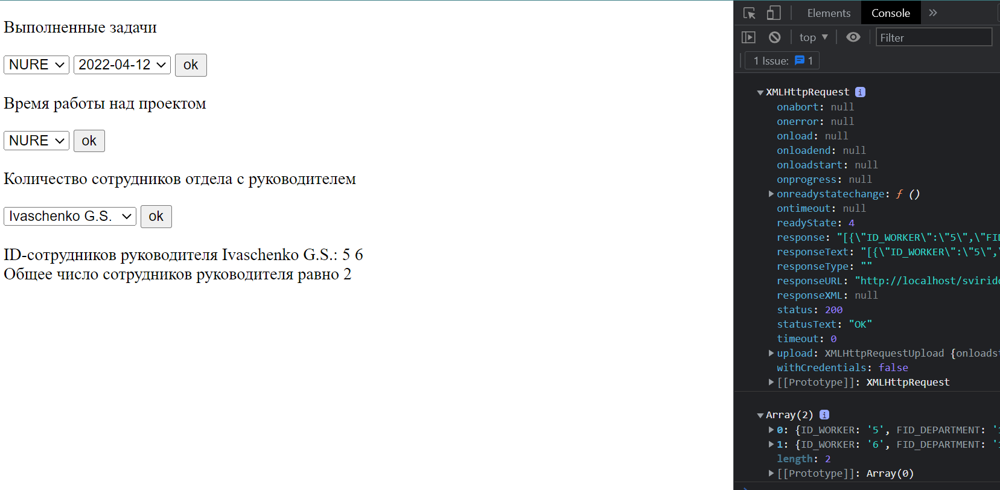
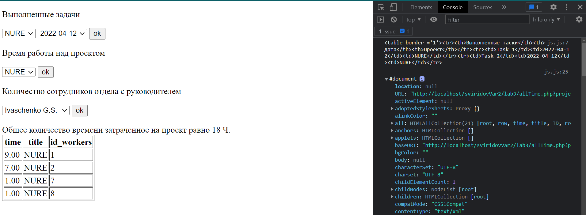

КИУКИ-19-1 Свиридов Александр Александрович

Изменить код для обработки данных результатов запросов (для параметризированных запросов, реализуемых в прошлой лабораторной по вариантам) таким образом, чтобы вывод результата пользователю не приводил к перезагрузке страницы - т.е. использовать технологию Ajax. Использовать следующие форматы ответа от сервера:

в формате простого текста (непосредственно получать сгенерированный фрагмент HTML-кода и выводить его в заданном элементе стартовой страницы);

в формате XML (результат запроса на выборку помещается в генерируемом сервером XML-документе, который клиент считывает через свойство responseXml и формирует вывод пользователю);

в формате JSON (результат запроса на выборку помещается в массив, который затем преобразуется в JSON-строку с помощью метода json_encode и отправляется клиенту, который получает данные выборки из строки с помощью метода JSON.parse и формирует вывод пользователю).

Обратите внимание, необходимо показать применение всех трех форматов ответа от сервера - по одному формату на каждый из трех запросов на выборку.
Возможно использование вместо XMLHttpRequest методов Fetch API для запроса, служащего примером работы с форматом JSON.

выполненных задачах по выбранному проекту на указанную дату;